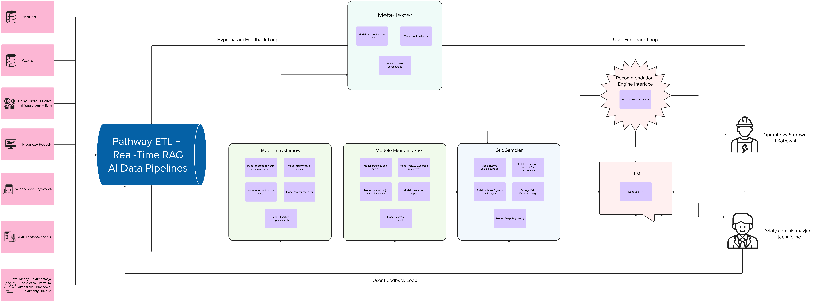

# 📊 GridGambler
---

---

## 1️⃣ MODELE SYSTEMOWE (Techniczne)
**Cel:** Optymalizacja efektywności elektrociepłowni, przewidywanie strat, analiza systemu pod kątem decyzji Tradera

| Model                          | Opis                                                                                                                                      | Technologie / Algorytmy                                                  | Biblioteki |
|--------------------------------|--------------------------------------------------------------------------------------------------------------------------------------------|---------------------------------------------------------------------------|------------|
| **Model zapotrzebowania na ciepło** | Prognozowanie zużycia ciepła w różnych częściach miasta. Uwzględnia temperaturę, dzień tygodnia, godziny szczytu. Kluczowe dla Tradera – informuje, czy można bezpiecznie obniżyć produkcję. | LSTM, Prophet, ARIMA, XGBoost                                               | [statsmodels](https://www.statsmodels.org/), [prophet](https://facebook.github.io/prophet/), [tensorflow](https://www.tensorflow.org/) |
| **Model strat cieplnych**         | Szacowanie strat w sieci ciepłowniczej – analiza wydajności przesyłu, izolacji rur, temperatur powrotu oraz warunków atmosferycznych.        | Modele fizyczne (równania strat ciepła), Graph Neural Networks (GNN)         | [networkx](https://networkx.github.io/), [PyG (PyTorch Geometric)](https://pytorch-geometric.readthedocs.io/) |
| **Model efektywności spalania**   | Analiza efektywności spalania paliwa – określa, jaką mieszankę paliw zastosować oraz jakie ustawienia procesu zapewniają optymalne parametry. Informuje operatora i Tradera o możliwych strategiach. | Regresja, modele spalania, symulacje Monte Carlo                            | [XGBoost](https://xgboost.readthedocs.io/), [OpenFOAM](https://openfoam.org/), [SHAP](https://shap.readthedocs.io/) |
| **Model kosztów operacyjnych**    | Optymalizacja kosztów operacyjnych – porównanie efektywności różnych strategii paliwowych (odpady, gaz, węgiel) w kontekście kosztów.         | Constraint Optimization, Bayesian Optimization                             | [cvxpy](https://www.cvxpy.org/), [bayesian-optimization](https://github.com/bayesian-optimization/BayesianOptimization) |
| **Model awaryjności sieci**       | Prognozowanie ryzyka awarii na podstawie analizy danych historycznych i wykrywania anomalii.                                               | Time-Series Anomaly Detection (Isolation Forest, Autoencoders)               | [isolation-forest](https://scikit-learn.org/stable/modules/generated/sklearn.ensemble.IsolationForest.html), [autoencoders](https://keras.io/examples/) |

---

## 2️⃣ MODELE RYNKOWE (Predykcja & Handel Energią)
**Cel:** Przewidywanie cen, zmienności rynku i wpływu wydarzeń – decyzje o strategii rynkowej

| Model                              | Opis                                                                                                                                       | Technologie / Algorytmy                                                   | Biblioteki |
|------------------------------------|-------------------------------------------------------------------------------------------------------------------------------------------|----------------------------------------------------------------------------|------------|
| **Model prognozy cen energii**       | Przewiduje ceny energii cieplnej i elektrycznej na podstawie danych historycznych oraz zmiennych makroekonomicznych i pogodowych.            | Time-Series Forecasting (Transformers, XGBoost, LSTM)                      | [sklearn](https://scikit-learn.org/), [tensorflow](https://www.tensorflow.org/), [pytorch](https://pytorch.org/) |
| **Model wpływu wydarzeń rynkowych**  | Analizuje wiadomości, regulacje i politykę, by określić ich wpływ na ceny energii. Informuje Tradera o możliwych zmianach (np. podatki CO₂).   | NLP + Sentiment Analysis (BERT, FinBERT)                                   | [transformers](https://huggingface.co/transformers/), [nltk](https://www.nltk.org/), [spacy](https://spacy.io/) |
| **Model optymalizacji zakupów paliwa** | Ocenia, kiedy opłaca się dokonać zakupu paliwa (węgiel, gaz, biomasa) na podstawie prognoz cenowych oraz trendów rynkowych.                      | Game Theory + Optimization                                                 | [cvxpy](https://www.cvxpy.org/), [pulp](https://coin-or.github.io/pulp/) |
| **Model zmienności popytu**         | Prognozuje nagłe zmiany zapotrzebowania na energię – identyfikuje anomalie (np. nagły atak zimy) oraz dynamiczne skoki popytu.                      | Hidden Markov Models, Gaussian Processes                                   | [hmmlearn](https://hmmlearn.readthedocs.io/), [GPy](https://sheffieldml.github.io/GPy/) |
| **Funkcja Celu Ekonomicznego** | Estymuje wpływ decyzji na uzyskiwane ceny energii, zysk ekonomiczny oraz strategię operacyjną elektrociepłowni.              | Bayesian Inference, Reinforcement Learning                                 | [pymc3](https://docs.pymc.io/), [stable-baselines3](https://stable-baselines3.readthedocs.io/) |

---

## 3️⃣ MODELE STRATEGICZNE (GridGambler Core)
**Cel:** Maksymalizacja zysku przez agresywne i strategiczne zarządzanie produkcją oraz dystrybucją ciepła  
*(Dane z modeli systemowych i rynkowych karmią tego "stratega")*

| Model                                          | Opis                                                                                                                                                  | Technologie / Algorytmy                                                       | Biblioteki |
|------------------------------------------------|-------------------------------------------------------------------------------------------------------------------------------------------------------|--------------------------------------------------------------------------------|------------|
| **Model strategii spekulacyjnych**   | Decyduje, kiedy grać agresywnie, a kiedy zachować ostrożność. Na podstawie danych z modeli systemowych i rynkowych wyznacza optymalne działania.   | Reinforcement Learning (DQN, PPO), Monte Carlo Simulations                      | [stable-baselines3](https://stable-baselines3.readthedocs.io/), [ray.rllib](https://docs.ray.io/en/latest/rllib.html) |
| **Model optymalizacji pracy kotłów w ekstremach** | Analizuje, czy warto zwiększyć produkcję lub przydusić kocioł dla maksymalizacji zysku, biorąc pod uwagę techniczne ograniczenia i koszty.                | Constraint Optimization, RL                                                   | [cvxpy](https://www.cvxpy.org/), [gurobi](https://www.gurobi.com/) |
| **Model analizy zachowań rynkowych**              | Prognozuje reakcje i strategie innych uczestników rynku poprzez symulację wieloagentową, analizę ewolucyjną oraz modelowanie z wykorzystaniem ABM.   | Agent-Based Modeling, Evolutionary Game Theory, Multi-Agent Reinforcement Learning | [mesa](https://mesa.readthedocs.io/), [pettingzoo](https://www.pettingzoo.ml/), [Gambit](https://github.com/gambitproject/gambit) |
| **Model zarządzania mocą szczytową**              | Przewiduje, kiedy najlepiej dostarczyć ciepło, aby uzyskać najlepsze warunki cenowe lub operacyjne, wykorzystując dostępne rezerwy systemu.                           | Reinforcement Learning, Multi-Agent Learning                                   | [maddpg](https://github.com/openai/maddpg), [pettingzoo](https://www.pettingzoo.ml/) |
| **Model elastycznego wykorzystania bezwładności cieplnej** | Analizuje możliwość wykorzystania naturalnej bezwładności cieplnej sieci do buforowania produkcji i poprawy efektywności operacyjnej.                 | Reinforcement Learning, Dynamic Programming                                    | [gym](https://gym.openai.com/), [jax](https://jax.readthedocs.io/) |

---

## 4️⃣ META-TESTER – Pętla Ulepszania
**Cel:** Uczenie modeli na podstawie rzeczywistych wyników, ciągła kalibracja strategii Tradera oraz modeli predykcyjnych.

| Moduł              | Opis                                                                                                                                          | Technologie / Algorytmy                                      | Biblioteki |
|--------------------|-----------------------------------------------------------------------------------------------------------------------------------------------|--------------------------------------------------------------|------------|
| **Meta-Tester AI** | Analizuje decyzje Tradera w kontekście rzeczywistych wyników. Jeśli decyzje są nietrafne, model wprowadza poprawki do strategii oraz parametrów predykcyjnych. | Modelowanie kontrfaktyczne, Simulacja Monte Carlo, Bayesian Optimization | [causalml](https://github.com/uber/causalml), [shap](https://shap.readthedocs.io/), [optuna](https://optuna.org/) |

---

# Podsumowanie technologiczne

| Komponent                           | Technologie / Biblioteki                                                              | Język       |
|-------------------------------------|---------------------------------------------------------------------------------------|-------------|
| **ETL + Data Pipelines**            | `Pathway`, `Apache Kafka`, `Apache Flink`                                             | Python, Rust|
| **Modele AI (predykcyjne & RL)**      | `TensorFlow`, `PyTorch`, `XGBoost`, `ARIMA`, `Prophet`                                  | Python      |
| **Optymalizacja / Teoria Gier**     | `cvxpy`, `scipy.optimize`, `Gurobi`, `Stable-Baselines3`, `Ray RLlib`                   | Python      |
| **NLP & Analiza Rynkowa**            | `transformers`, `nltk`, `spacy`, `pymc3`                                                | Python      |
| **Agent-Based Modeling / Multi-Agent** | `mesa`, `pettingzoo`, `gambit`                                                     | Python      |
| **Dashboard/Interfejs**             | `Grafana`, `GrafanaOnCall`                                                                   | Python, JavaScript |
| **Bazy Danych (Opcjonalnie)**                     | `PostgreSQL (TimescaleDB)`, `InfluxDB`, `Redis`                                         | SQL, Python |

---

# Wprowadzenie

**GridGambler** to zaawansowany system AI zaprojektowany do optymalizacji operacji w elektrociepłowniach. System integruje dane operacyjne, rynkowe oraz prognozy pogodowe, by na bieżąco dostarczać rekomendacje strategiczne. Dzięki wielowarstwowym modelom – od systemowych, przez rynkowe, po strategiczne – GridGambler zarządza zasobami ciepła i optymalizuje produkcję, maksymalizując zyski przy jednoczesnym zapewnieniu stabilnych dostaw dla mieszkańców.

### Jak działa GridGambler?

1. **ETL & Data Pipelines:**  
   System pobiera dane z SCADA, Historiana, Abaro, API rynkowych, wiadomości oraz prognoz pogodowych. Wszystkie te dane są przetwarzane w czasie rzeczywistym przez silnik ETL (np. Pathway).

2. **Modele Systemowe & Rynkowe:**  
   Dane są analizowane przez modele techniczne (np. zapotrzebowania na ciepło, strat cieplnych, efektywności spalania) oraz modele rynkowe (prognozy cen energii, analiza wpływu wydarzeń).

3. **Trader/Gambler AI:**  
   Trader AI, oparty na Reinforcement Learning oraz metodach teorii gier, analizuje dane z modeli i podejmuje decyzje strategiczne – kiedy zwiększyć produkcję, a kiedy ją ograniczyć, by osiągnąć maksymalny zysk.

4. **Meta-Tester:**  
   Cały system jest w pętli ciągłego uczenia. Meta-Tester analizuje wyniki decyzji Tradera, porównuje je z rzeczywistymi danymi i dostraja modele, by system stale się poprawiał.

5. **Interfejs:**  
   Rekomendacje są prezentowane operatorom za pomocą przyjaznych dashboardów, umożliwiając im podejmowanie ostatecznych decyzji.

---

GridGambler działa w hybrydowym środowisku – głównie w Pythonie, ale z wykorzystaniem wydajnych rozwiązań (Rust/C++ dla krytycznych obliczeń) oraz nowoczesnych interfejsów (React, FastAPI). Dzięki temu system jest zarówno elastyczny, jak i wydajny, umożliwiając maksymalizację zysków przy jednoczesnym zapewnieniu stabilności operacyjnej.

---

## Co dalej?

# 🔥 Przykład - Integracja AVEVA Historian z Pathway – Strumieniowe Przetwarzanie Danych  

## 📌 Cel  
Łączymy się z **AVEVA Historian**, pobieramy dane o temperaturach węzła cieplnego i **strumieniowo przetwarzamy je w Pathway**, zamiast zapisywać do pliku. Dzięki temu dane mogą trafić bezpośrednio do modelu optymalizacji.

---

## ⚙️ Instalacja wymaganych bibliotek  

Aby uruchomić kod, zainstaluj potrzebne zależności:  

```bash
pip install pyodbc pandas pathway
```

**## ⚙️ Kod Python**

```python
import pyodbc  # Połączenie z bazą SQL (AVEVA Historian)
import pandas as pd  # Operacje na danych tabelarycznych
import pathway as pw  # Przetwarzanie strumieniowe

# 🔹 KROK 1: Połączenie z bazą danych AVEVA Historian
connection_string = (
    "DRIVER={SQL Server};"  # Sterownik ODBC do SQL Server
    "SERVER=your_server_name;"  # Nazwa serwera bazy danych
    "DATABASE=Runtime;"  # Baza danych Historiana
    "UID=your_username;"  # Użytkownik bazy
    "PWD=your_password;"  # Hasło
)

# 🔹 KROK 2: Definiujemy zapytanie SQL do pobrania danych historycznych
query = """
SELECT DateTime, TagName, Value
FROM [INSQL].Runtime.dbo.History
WHERE TagName IN ('ThermalNode.Temperature_In', 'ThermalNode.Temperature_Out')  -- Czujniki temperatury na węźle
AND DateTime >= DATEADD(MINUTE, -10, GETDATE())  -- Pobieramy ostatnie 10 minut
ORDER BY DateTime;
"""

# 🔹 KROK 3: Strumieniowe pobieranie danych z Historiana i wysyłanie ich do Pathway
class HistorianConnector(pw.io.Connector):  
    def run(self):
        """Łączymy się z AVEVA Historian i cyklicznie pobieramy dane"""
        while True:
            with pyodbc.connect(connection_string) as conn:
                df = pd.read_sql(query, conn)  # Pobieramy dane SQL do Pandas DataFrame
            for _, row in df.iterrows():
                self.emit({
                    "DateTime": row["DateTime"],
                    "TagName": row["TagName"],
                    "Value": row["Value"]
                })  # Wysyłamy pojedyncze rekordy do Pathway
            pw.sleep(60)  # Aktualizujemy dane co minutę

# 🔹 KROK 4: Tworzymy tabelę Pathway, która odbiera strumień danych
class HistorianSchema(pw.Schema):
    DateTime: pw.Timestamp
    TagName: str
    Value: float

historian_stream = pw.Table.from_connector(
    HistorianConnector(), schema=HistorianSchema
)

# 🔹 KROK 5: Pivotowanie danych, aby uzyskać osobne kolumny dla temperatury wejściowej i powrotnej
pivoted_table = historian_stream.groupby("DateTime").pivot(
    columns="TagName", values="Value"
).aggregate(
    Temperature_In=pw.reducers.first("ThermalNode.Temperature_In"),
    Temperature_Out=pw.reducers.first("ThermalNode.Temperature_Out"),
)

# 🔹 KROK 6: Obliczamy stratę ciepła w strumieniu
result_stream = pivoted_table.select(
    "DateTime",
    "Temperature_In",
    "Temperature_Out",
    DeltaTemperature=pw.this.Temperature_In - pw.this.Temperature_Out,
)

# 🔹 KROK 7: Strumieniowe wysyłanie danych do modelu
pw.io.default = pw.io.Stream()  # Konfigurujemy Pathway na strumieniowe przetwarzanie danych
result_stream.to_stream()  # Wysyłamy dane do dalszego przetwarzania w modelu

# ✅ Gotowe! Pathway będzie teraz na bieżąco pobierał dane z AVEVA Historian i przesyłał je do modelu.

```
